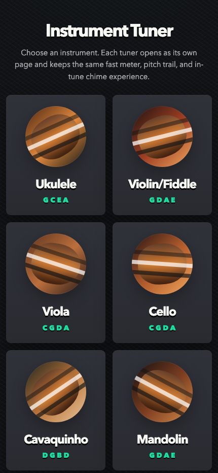

# Instrument Tuner

A lightweight, browser-based tuner for ukulele and other string instruments. Each instrument has its own tuner page with real-time microphone pitch detection, a cents meter, pitch trail notes, and an in-tune chime.

## Live Site

Use it here: [https://magic-bunny.github.io/ukelele-helper/](https://magic-bunny.github.io/ukelele-helper/)



## Supported Instruments

- Ukulele: High G and Low G
- Violin/Fiddle
- Viola
- Cello
- Cavaquinho
- Mandolin
- Balalaika
- Banjo: 4-string and 5-string

## Features

- Separate tuner page per instrument
- Real-time microphone pitch detection using the Web Audio API
- Automatic string matching for each instrument tuning
- Manual target lock by tapping a string button
- Visual cents meter with flat/sharp guidance
- Downward scrolling pitch trail notes
- In-tune check icon and short chime
- Input level indicator
- Mobile-first responsive interface
- No build step and no external runtime dependencies

## Usage

1. Open the [live site](https://magic-bunny.github.io/ukelele-helper/).
2. Choose an instrument from the home page.
3. Allow microphone access when prompted.
4. Play one open string at a time.
5. Follow the meter and text guidance:
   - `Flat`: tighten the string.
   - `Sharp`: loosen the string.
   - `In tune`: the string is within the target range.
6. Tap a string button to lock the tuner to that target. Tap it again to return to automatic matching.

## Local Development

Because microphone access usually requires a secure context, run the page from `localhost` instead of opening the file directly if your browser blocks the microphone.

```bash
python3 -m http.server 8000
```

Then open:

```text
http://localhost:8000
```

## Browser Notes

- Works best in modern Chromium, Safari, and Firefox browsers.
- Microphone permission is required.
- HTTPS or `localhost` may be required for microphone access.
- For the most stable reading, tune in a quiet room and play one string clearly.

## Project Structure

```text
.
├── docs/
│   └── screenshot.png  # Site screenshot for README
├── index.html          # Instrument picker home page
├── tuner.css           # Shared tuner styling
├── tuner.js            # Shared tuner logic and instrument configs
├── *.html              # Individual instrument tuner pages
└── README.md           # Project documentation
```

## License

No license has been specified yet.
